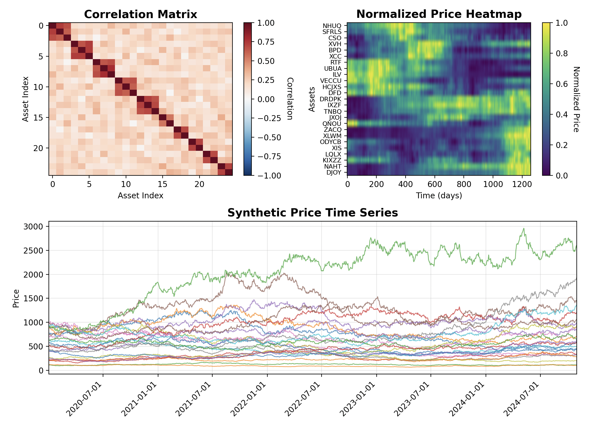

# SynthFin

A Python package for generating synthetic financial time series data with realistic correlation structures and multiple stochastic process models.



## Features

- **Flexible Correlation Generation**
  - Naive random correlation matrices
  - Hierarchical correlation structures simulating sector/industry clusters
  - Extensible framework for custom correlation models

- **Multiple Time Series Models**
  - Geometric Brownian Motion (GBM)
  - Jump-Diffusion (Merton model)
  - Easy to add custom stochastic processes

- **Correlated Multi-Asset Simulation**
  - Cholesky decomposition for maintaining correlation structure
  - Configurable number of assets and time periods
  - Realistic business day calendars

- **Rich Output Options**
  - Pandas DataFrames with business day indices
  - CSV export functionality
  - Automatic ticker symbol generation

- **Comprehensive Visualization**
  - Correlation matrix heatmaps
  - Price evolution heatmaps
  - Multi-asset time series plots

## Installation

### From PyPI (coming soon)
```bash
pip install synthfin
```

### From Source
```bash
git clone https://github.com/mhallsmoore/synthfin.git
cd synthfin
pip install -e .
```

### Development Installation
```bash
git clone https://github.com/mhallsmoore/synthfin.git
cd synthfin
pip install -e ".[dev]"
```

## Quick Start

### Basic Usage

```python
from synthfin import SyntheticTimeSeriesPipeline

# Create and run pipeline with default configuration
pipeline = SyntheticTimeSeriesPipeline()
df, correlation_matrix = pipeline.run()

# df is a Pandas DataFrame with synthetic prices
print(df.head())
```

### Using Configuration File

Create a `config.yaml` file:

```yaml
correlation:
  model: "hierarchical"
  parameters:
    hierarchical:
      n_clusters: 4
      intra_cluster_corr: 0.7
      inter_cluster_corr: 0.2

time_series:
  model: "gbm"
  common:
    drift: 0.05
    volatility: 0.2

simulation:
  n_assets: 20
  n_days: 252
```

Then run:

```python
from synthfin import SyntheticTimeSeriesPipeline

pipeline = SyntheticTimeSeriesPipeline("config.yaml")
df, correlation_matrix = pipeline.run()
```

### Programmatic Usage

```python
from synthfin.correlation import HierarchicalCorrelationGenerator
from synthfin.models import GeometricBrownianMotion
from synthfin.generator import CorrelatedTimeSeriesGenerator
from synthfin.output import DataFrameFormatter
from datetime import datetime
import numpy as np

# Set up correlation structure
n_assets = 15
corr_gen = HierarchicalCorrelationGenerator(
    n=n_assets,
    n_clusters=3,
    intra_cluster_corr=0.6,
    inter_cluster_corr=0.15
)

# Create time series models
models = []
for i in range(n_assets):
    model = GeometricBrownianMotion(
        start_price=np.random.uniform(50, 500),
        drift=0.06,
        volatility=0.22
    )
    models.append(model)

# Generate correlated time series
generator = CorrelatedTimeSeriesGenerator(corr_gen, models)
price_matrix, corr_matrix = generator.generate(n_days=252)

# Format as DataFrame
formatter = DataFrameFormatter()
df = formatter.format(price_matrix, datetime(2024, 1, 2))
```

## Examples

### Example 1: Simulating Tech Sector with High Correlations

```python
from synthfin import create_config, SyntheticTimeSeriesPipeline

config = create_config(
    correlation_model="hierarchical",
    correlation_params={
        "n_clusters": 3,
        "intra_cluster_corr": 0.85,
        "inter_cluster_corr": 0.3
    },
    time_series_model="gbm",
    n_assets=30,
    n_days=252
)

pipeline = SyntheticTimeSeriesPipeline(config)
df, corr_matrix = pipeline.run()
```

### Example 2: Jump-Diffusion Model for Crisis Simulation

```python
config = create_config(
    time_series_model="jump_diffusion",
    time_series_params={
        "drift": 0.05,
        "volatility": 0.25,
        "jump_intensity": 0.2,
        "jump_mean": -0.05,
        "jump_std": 0.15
    },
    n_assets=20,
    n_days=60
)

pipeline = SyntheticTimeSeriesPipeline(config)
df, corr_matrix = pipeline.run()
```

### Example 3: Custom Visualization

```python
from synthfin.visualization import TimeSeriesVisualizer

# Generate data
pipeline = SyntheticTimeSeriesPipeline()
df, corr_matrix = pipeline.run()

# Create custom visualizations
visualizer = TimeSeriesVisualizer(figsize=(20, 15))
visualizer.plot_all(df, corr_matrix, save_plots=True)
```

## Configuration Options

### Correlation Models

- **naive**: Random uniform sampling
  ```yaml
  correlation:
    model: "naive"
  ```

- **hierarchical**: Sector-based clustering
  ```yaml
  correlation:
    model: "hierarchical"
    parameters:
      hierarchical:
        n_clusters: 4
        intra_cluster_corr: 0.7
        inter_cluster_corr: 0.2
        noise_level: 0.1
  ```

### Time Series Models

- **gbm**: Geometric Brownian Motion
  ```yaml
  time_series:
    model: "gbm"
    common:
      drift: 0.05
      volatility: 0.2
  ```

- **jump_diffusion**: Merton Jump-Diffusion
  ```yaml
  time_series:
    model: "jump_diffusion"
    common:
      drift: 0.05
      volatility: 0.2
    parameters:
      jump_diffusion:
        jump_intensity: 0.1
        jump_mean: 0.0
        jump_std: 0.1
  ```

## Extending SynthFin

### Adding a New Correlation Model

```python
from synthfin.correlation import CorrelationMatrixGenerator
import numpy as np

class MyCorrelationGenerator(CorrelationMatrixGenerator):
    def generate(self) -> np.ndarray:
        # Your implementation here
        pass

# Register the model
from synthfin.main import CORRELATION_MODELS
CORRELATION_MODELS["my_model"] = MyCorrelationGenerator
```

### Adding a New Time Series Model

```python
from synthfin.models import TimeSeriesModel
import numpy as np

class MyTimeSeriesModel(TimeSeriesModel):
    def generate_path(self, n_steps: int, random_shocks: np.ndarray) -> np.ndarray:
        # Your implementation here
        pass

# Register the model
from synthfin.main import TIME_SERIES_MODELS
TIME_SERIES_MODELS["my_model"] = MyTimeSeriesModel
```

## API Reference

### Core Classes

- `SyntheticTimeSeriesPipeline`: Main pipeline orchestrator
- `CorrelationMatrixGenerator`: Base class for correlation generators
- `TimeSeriesModel`: Base class for time series models
- `CorrelatedTimeSeriesGenerator`: Generates correlated time series using Cholesky decomposition
- `DataFrameFormatter`: Formats output as Pandas DataFrame
- `TimeSeriesVisualizer`: Creates visualizations

### Utility Functions

- `create_config()`: Helper function to create configuration dictionaries
- `load_config()`: Load configuration from YAML file
- `validate_correlation_matrix()`: Check if matrix is valid correlation matrix

## Contributing

Contributions are welcome! Please feel free to submit a Pull Request. For major changes, please open an issue first to discuss what you would like to change.

1. Fork the repository
2. Create your feature branch (`git checkout -b feature/AmazingFeature`)
3. Commit your changes (`git commit -m 'Add some AmazingFeature'`)
4. Push to the branch (`git push origin feature/AmazingFeature`)
5. Open a Pull Request

## Testing

Run the test suite:

```bash
pytest tests/
```

Run with coverage:

```bash
pytest --cov=synthfin tests/
```

## License

This project is licensed under the MIT License - see the [LICENSE](LICENSE) file for details.

## Citation

If you use SynthFin in your research, please cite:

```bibtex
@software{synthfin,
  title = {SynthFin: Synthetic Financial Time Series Generation},
  author = {M.L. Halls-Moore},
  year = {2025},
  url = {https://github.com/mhallsmoore/synthfin}
}
```